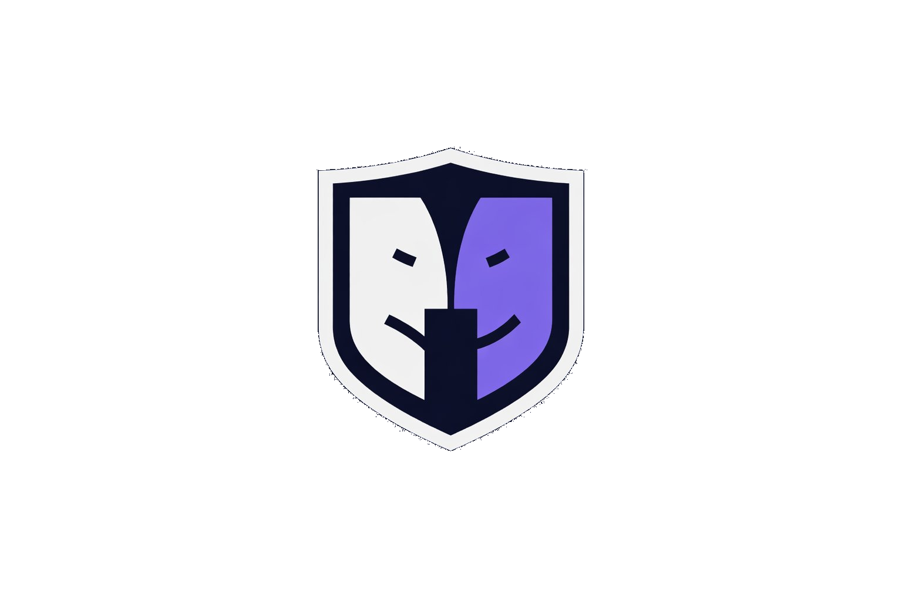
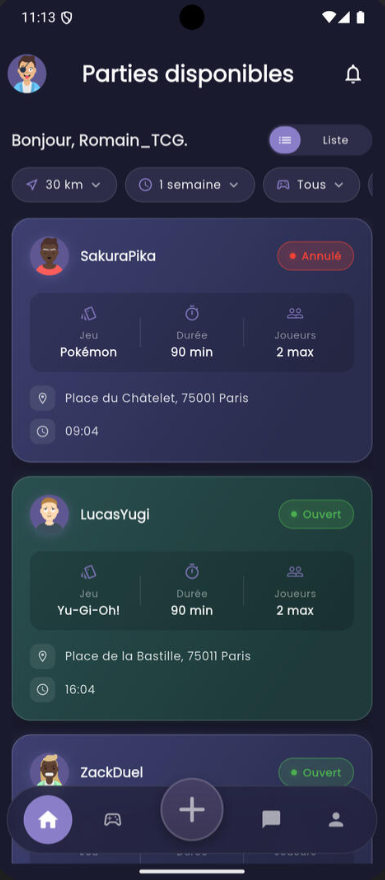
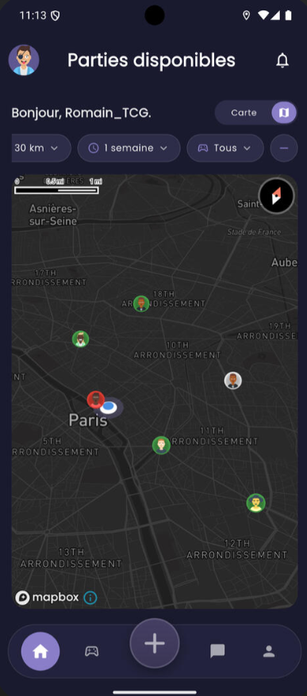
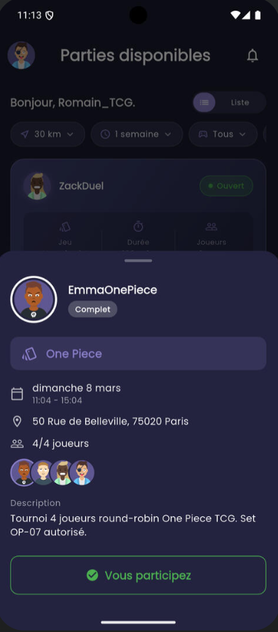
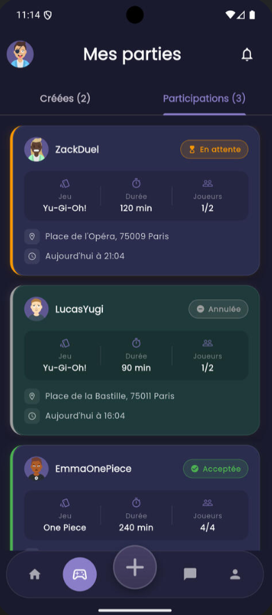

<p align="center">
  
</p>

<h1 align="center">DuelFinder</h1>

<p align="center">
  Application mobile de mise en relation de joueurs de TCG (Trading Card Games).<br>
  Trouvez des parties près de chez vous, rejoignez des sessions, et chattez avec d'autres joueurs en temps réel.
</p>

**Backend déployé sur Railway :** `https://api.duelfinder.com/api`

---

## Aperçu

<p align="center">
  
  &nbsp;
  
  &nbsp;
  
  &nbsp;
  
</p>

<p align="center">
  <sub>Liste &amp; filtres · Carte interactive (Mapbox) · Détail d'une partie · Mes parties &amp; participations</sub>
</p>

---

## Fonctionnalités

- **Carte interactive** — Visualisez les parties ouvertes autour de vous (Mapbox)
- **Recherche géolocalisée** — Filtres par distance, type de jeu, créneau horaire
- **Création de partie** — Définissez lieu, date, durée et nombre de joueurs
- **Système de participation** — Demandez à rejoindre une partie, acceptation/refus par le créateur
- **Chat en temps réel** — Messagerie par partie entre participants
- **Notifications push** — Firebase Cloud Messaging pour les événements clés
- **Authentification** — Email/mot de passe + OAuth Facebook et Instagram
- **Profil & avatar** — Upload d'avatar via Cloudinary, historique de parties, niveaux Bronze/Silver/Gold
- **Anti-spam** — Limitation de créations et demandes de participation
- **Archivage & suppression** — Archiver les parties terminées, suppression définitive des parties et participations
- **Masquage de conversations** — Cacher les conversations archivées
- **Système NPC** — Comptes bots de démonstration pré-remplis (3 villes, 20 profils)
- **Pages légales** — CGU et politique de confidentialité

---

## Jeux supportés

| Jeu | Couleur |
|-----|---------|
| Pokémon TCG | Jaune `#FFCC00` |
| Yu-Gi-Oh! | Or `#B8860B` |
| One Piece Card Game | Rouge `#E63946` |
| Naruto TCG | Orange `#FF6B35` |

---

## Stack technique

### Mobile — Flutter

| Outil | Rôle |
|-------|------|
| Flutter 3.2+ | Framework UI cross-platform |
| Riverpod 2.5 | State management |
| GoRouter 14 | Navigation déclarative |
| Dio 5 | Client HTTP + intercepteurs |
| Mapbox / Google Maps | Carte interactive |
| Firebase Messaging | Notifications push |
| Geolocator | Géolocalisation |
| flutter_secure_storage | Stockage sécurisé des tokens |
| Freezed + JsonSerializable | Modèles immuables + sérialisation |

### Backend — Node.js

| Outil | Rôle |
|-------|------|
| Node.js (ES Modules) | Runtime |
| Express.js 4 | Framework HTTP |
| Prisma 5 | ORM + migrations |
| PostgreSQL 16 | Base de données |
| JWT + bcrypt | Authentification |
| Firebase Admin | Envoi de notifications |
| Cloudinary | Upload et traitement d'images (avatars) |
| Multer | Middleware d'upload de fichiers |
| Helmet | Headers de sécurité |
| express-rate-limit | Protection anti-abus |

---

## Structure du projet

```
duelfinder/
├── app/                            # Application Flutter
│   ├── lib/
│   │   ├── main.dart               # Point d'entrée
│   │   ├── core/
│   │   │   ├── constants/          # URLs API, pagination, timeouts
│   │   │   ├── di/                 # Providers Riverpod globaux
│   │   │   ├── errors/             # Gestion des erreurs Dio
│   │   │   ├── network/            # Client Dio, connectivité
│   │   │   ├── router/             # Configuration GoRouter
│   │   │   ├── services/           # Firebase, localisation, stockage
│   │   │   └── theme/              # Thème Material 3
│   │   ├── features/
│   │   │   ├── auth/               # Login, Register, Splash
│   │   │   ├── games/              # Création, liste, archivage de parties
│   │   │   ├── home/               # Écran carte + filtres
│   │   │   ├── legal/              # CGU & politique de confidentialité
│   │   │   ├── messages/           # Conversations & chat
│   │   │   ├── notifications/      # Centre de notifications
│   │   │   ├── participations/     # Gestion des demandes
│   │   │   ├── profile/            # Profil, avatar & paramètres
│   │   │   └── shell/              # Navigation principale (bottom nav)
│   │   └── shared/                 # Widgets réutilisables
│   ├── assets/images/              # Logos et icônes
│   └── android/                    # Config Android
│
└── backend/                        # API Node.js
    ├── src/
    │   ├── server.js               # Point d'entrée
    │   ├── app.js                  # Setup Express
    │   ├── config/                 # DB, Firebase, JWT, Cloudinary
    │   ├── controllers/            # Handlers de routes
    │   ├── services/               # Logique métier
    │   ├── routes/                 # Définition des routes
    │   └── middlewares/            # Auth, erreurs, rate limiting, upload
    ├── prisma/
    │   ├── schema.prisma           # Modèles de données
    │   ├── seed.js                 # Données de test
    │   └── migrations/             # Historique des migrations
    ├── scripts/
    │   ├── seed_launch.js          # Création des comptes NPC
    │   ├── cron_daily.js           # Tâches de maintenance quotidiennes
    │   ├── cleanup_ghost.js        # Nettoyage des données expirées
    │   └── npc_config.js           # Configuration des bots
    └── docker-compose.yml          # PostgreSQL local
```

---

## Modèles de données

### User
```
id, email, passwordHash, username, bio, avatar
fcmToken, facebookId, instagramId
role: USER | PARTNER | ADMIN
totalGamesPlayed, badgeLevel: BRONZE | SILVER | GOLD
hiddenConversations: String[]
```

### Game
```
id, gameType: POKEMON | YUGIOH | ONE_PIECE | NARUTO
description, address, latitude, longitude
scheduledAt, duration (minutes), maxPlayers
status: OPEN | FULL | CANCELLED
creatorId, wasFilledOnce
finishedAt, archivedAt, lastReadByCreatorAt
```

### Participation
```
id, status: PENDING | ACCEPTED | REJECTED | CANCELLED
userId, gameId (unique)
acceptedAt, lastReadAt
```

### Message
```
id, content, senderId, gameId, createdAt
```

### Notification
```
id, type, title, body, data (JSON), read
userId, createdAt

types: PARTICIPATION_REQUEST | PARTICIPATION_ACCEPTED | PARTICIPATION_REJECTED
       PARTICIPATION_CANCELLED | NEW_MESSAGE | GAME_CANCELLED | GAME_FULL
```

---

## API REST

### Auth — `/api/auth`
```
POST  /register       Créer un compte (limité : 10/15min)
POST  /login          Connexion email/mot de passe
POST  /facebook       OAuth Facebook
POST  /instagram      OAuth Instagram
POST  /refresh        Renouveler l'access token
GET   /me             Profil utilisateur connecté
```

### Utilisateurs — `/api/users`
```
GET    /me            Mon profil
PUT    /me            Modifier mon profil
PUT    /me/avatar     Uploader un avatar (Cloudinary, max 5 Mo)
PUT    /me/fcm-token  Mettre à jour le token Firebase
PUT    /me/password   Changer le mot de passe
DELETE /me            Supprimer le compte
GET    /:id           Profil public d'un utilisateur
```

### Parties — `/api/games`
```
GET    /existing                     Parties à proximité (auth optionnel)
                                     ?lat=&lng=&distance=&dateFrom=&dateTo=&gameType=
GET    /my-games                     Mes parties créées
POST   /                             Créer une partie
DELETE /:gameId                      Annuler une partie
DELETE /:gameId/permanent            Supprimer définitivement une partie
PATCH  /:gameId/archive              Archiver une partie terminée

GET    /:gameId/participations       Demandes de participation
POST   /:gameId/participations       Demander à rejoindre
GET    /:gameId/messages             Messages de la partie
POST   /:gameId/messages             Envoyer un message
PUT    /:gameId/messages/read        Marquer comme lus
```

### Participations — `/api/participations`
```
GET    /my               Mes demandes de participation
PUT    /:id/accept       Accepter une demande (créateur uniquement)
PUT    /:id/reject       Refuser une demande (créateur uniquement)
PATCH  /:id/cancel       Annuler ma participation
DELETE /:id/permanent    Supprimer définitivement une participation
```

### Messages — `/api/messages`
```
GET    /conversations              Toutes mes conversations
DELETE /conversations/:gameId      Masquer une conversation archivée
DELETE /:id                        Supprimer un message
```

### Notifications — `/api/notifications`
```
GET    /               Mes notifications
GET    /unread-count   Nombre de non-lues
PUT    /read-all       Tout marquer comme lu
PUT    /:id/read       Marquer une notification comme lue
DELETE /:id            Supprimer une notification
```

---

## Installation

### Prérequis

- Flutter SDK 3.2+
- Node.js 18+
- Docker & Docker Compose
- Clés API : Mapbox, Firebase (FCM), Cloudinary

### Backend

```bash
cd backend
cp .env.example .env       # Remplir les variables d'environnement
npm install                # Installe les dépendances + génère le client Prisma (postinstall)
docker-compose up -d       # Démarre PostgreSQL sur le port 5433
npx prisma migrate dev     # Applique les migrations
npm run prisma:seed        # (optionnel) Données de test
npm run dev                # Démarre l'API sur le port 3000
```

### Mobile

```bash
cd app
flutter pub get
flutter run
```

> Pour la carte, renseigner le token Mapbox dans `app/.env` (voir [`app/.env.example`](app/.env.example)).

---

## Variables d'environnement

| Variable | Requis | Description |
|---|---|---|
| `DATABASE_URL` | ✅ | URL PostgreSQL (valeurs docker-compose par défaut en local, port 5433) |
| `JWT_SECRET`, `JWT_REFRESH_SECRET` | ✅ | Clés de signature des tokens |
| `ACCESS_TOKEN_EXPIRY`, `REFRESH_TOKEN_EXPIRY` | ✅ | Durées de validité (ex. `15m`, `7d`) |
| `FIREBASE_PROJECT_ID`, `FIREBASE_PRIVATE_KEY`, `FIREBASE_CLIENT_EMAIL` | ✅ | Firebase Admin (notifications push FCM) |
| `CLOUDINARY_CLOUD_NAME`, `CLOUDINARY_API_KEY`, `CLOUDINARY_API_SECRET` | ✅ | Upload des avatars |
| `FACEBOOK_APP_ID`, `FACEBOOK_APP_SECRET` | ⚪ | OAuth Facebook (optionnel) |
| `INSTAGRAM_CLIENT_ID`, `INSTAGRAM_CLIENT_SECRET` | ⚪ | OAuth Instagram (optionnel) |
| `PORT`, `NODE_ENV` | ✅ | Configuration serveur |
| `SEED_PASSWORD` | seed | Mot de passe des comptes de démo créés par `npm run prisma:seed` |

> Référence complète avec valeurs par défaut locales : [`backend/.env.example`](backend/.env.example).
> Côté mobile, renseigner `MAPBOX_TOKEN` dans `app/.env` — cf. [`app/.env.example`](app/.env.example).

---

## Scripts utilitaires

```bash
# Prisma
npx prisma generate         # Génère le client Prisma (auto via postinstall)
npm run prisma:migrate       # Applique les migrations
npm run prisma:studio        # Interface visuelle de la BDD

# Données
npm run prisma:seed          # Insère des données de test
npm run npc:seed             # Crée les comptes NPC (bots)
npm run npc:cron             # Lance les tâches quotidiennes (cron)
npm run npc:cleanup          # Nettoie les données expirées
```

---

## Sécurité & anti-spam

| Protection | Limite |
|-----------|--------|
| Rate limiter global | 100 req/min par IP |
| Auth (login/register) | 10 tentatives / 15 min |
| Création de partie | 1 partie non remplie / jour / utilisateur |
| Demandes de participation | 20 / heure |
| Tokens JWT | Access : 15 min — Refresh : 7 jours |
| Upload avatar | Max 5 Mo, JPEG/PNG/WebP uniquement |
| Headers sécurité | Helmet activé |

---

## Déploiement

Le backend est hébergé sur **Railway** avec une base PostgreSQL managée.

```
API : https://api.duelfinder.com/api
```

- `postinstall` exécute `prisma generate` automatiquement au déploiement
- Pre-deploy : `npx prisma migrate deploy` applique les migrations
- Cron Railway : `node scripts/cron_daily.js` (quotidien, recommandé 23h00)

Pour déployer une nouvelle version :
```bash
git push origin main   # Railway déploie automatiquement depuis main
```
